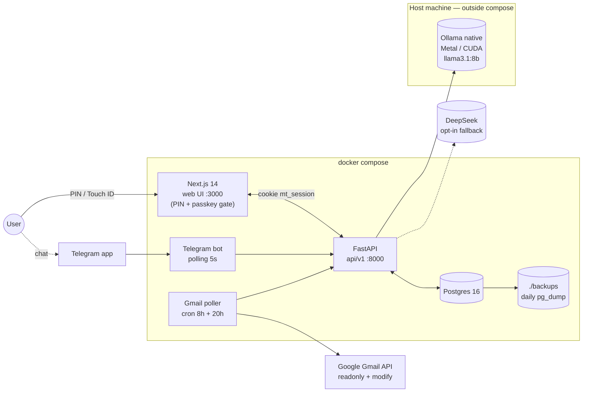
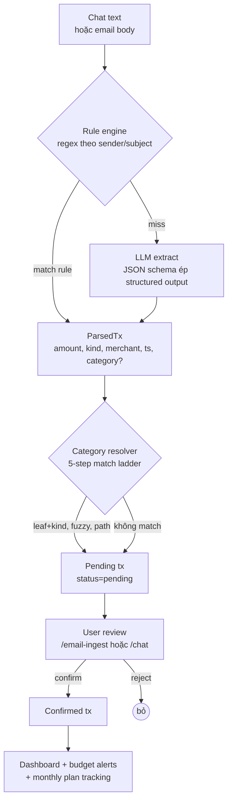

# Money Tracking

Ứng dụng web local quản lý chi tiêu cá nhân, dùng LLM local (Ollama) hoặc cloud (DeepSeek) để:

- Trích xuất giao dịch từ chat (web + Telegram)
- Đọc biên lai giao dịch từ Gmail (OAuth, read-only)
- Phân loại tự động, cảnh báo vượt ngân sách, tổng kết định kỳ
- Tương tác song song qua web UI và Telegram bot

Toàn bộ dữ liệu lưu trên máy (SQLite), không gửi raw ra cloud.

## Kiến trúc

### Container & data flow



Ollama nằm **ngoài** compose cố ý để dùng Metal/CUDA GPU của host. Các service trong compose gọi ra `host.docker.internal:11434`.

### Luồng ingest giao dịch



Confidence thấp hoặc JSON invalid → retry temperature=0, vẫn fail → cloud fallback (nếu `LLM_ALLOW_CLOUD=true`).

## Quick start

```bash
# 1. Cấu hình
cp .env.example .env
# Điền: OLLAMA_URL, TELEGRAM_BOT_TOKEN, TELEGRAM_CHAT_ID, GOOGLE_CLIENT_ID/SECRET

# 2. Chạy
docker compose up -d

# 3. Mở web
open http://localhost:3000
```

Chi tiết xem [docs/](./docs/).

## Self-host LLM 8B local (Ollama)

Provider `m1ultra` là Ollama **native chạy trên host** (cố ý không bọc Docker để
tận dụng Metal/CUDA GPU). App kết nối ra host qua `host.docker.internal`.

### 1. Cài Ollama + kéo model 8B

```bash
# macOS
brew install ollama
# hoặc Linux
curl -fsSL https://ollama.com/install.sh | sh

# Daemon chạy port 11434
ollama serve &

# Kéo model 8B — chọn 1 trong các option dưới:
ollama pull llama3.1:8b             # Meta, tool calling khoẻ, khuyên dùng
ollama pull qwen2.5:7b-instruct     # balance speed/quality
ollama pull mistral:7b-instruct     # nhẹ nhất, latency thấp

# Embedding cho category kNN (bắt buộc)
ollama pull nomic-embed-text

# Verify
curl -s http://127.0.0.1:11434/api/tags | jq '.models[].name'
ollama run llama3.1:8b "chào"
```

### 2. Config `.env`

```bash
LLM_DEFAULT_PROVIDER=m1ultra

# ⚠️ URL phụ thuộc cách chạy app:
#   Docker Compose → host.docker.internal
#   Native dev     → 127.0.0.1
M1ULTRA_URL=http://host.docker.internal:11434

M1ULTRA_MODEL=llama3.1:8b             # fast-path extract (chat + email)
M1ULTRA_AGENT_MODEL=llama3.1:8b       # ReAct tool-calling (tách riêng nếu
                                      # extract model là uncensored finetune)
M1ULTRA_EMBED_MODEL=nomic-embed-text
M1ULTRA_TIMEOUT=120
```

### 3. Reload + verify

```bash
docker compose restart api bot gmail
```

Mở http://localhost:3000/providers → click **Ping**. Nếu < 1s là ok. Sau đó
thử một câu ở `/chat`, ví dụ *"trưa ăn phở 45k bằng momo"* — phải trả về 1
transaction pending.

### Yêu cầu phần cứng

| Model (Q4_K_M) | RAM/VRAM | Token/s ước tính |
|---|---|---|
| `mistral:7b` | ~4.5 GB | 40–60 (M2 Pro) / 60–90 (RTX 3060) |
| `qwen2.5:7b-instruct` | ~5 GB | 35–55 |
| `llama3.1:8b` | ~5 GB | 30–50 |

Mac Apple Silicon có Ollama tự dùng Metal (không cần CUDA). Linux/Windows
khuyên NVIDIA ≥ 8GB VRAM để không nghẽn extract khi ingest email batch.

Xem thêm chiến lược routing + fallback cloud: [docs/06-llm-strategy.md](./docs/06-llm-strategy.md).

## Tài liệu

- [Tổng quan & mục tiêu](./docs/01-overview.md)
- [Kiến trúc hệ thống](./docs/02-architecture.md)
- [Tech stack](./docs/03-tech-stack.md)
- [Data model](./docs/04-data-model.md)
- [Tính năng](./docs/05-features.md)
- [Chiến lược LLM](./docs/06-llm-strategy.md)
- [Tích hợp Gmail](./docs/07-gmail.md)
- [Telegram bot](./docs/08-telegram.md)
- [API spec](./docs/09-api.md)
- [Bảo mật & quyền riêng tư](./docs/10-security.md)
- [Triển khai](./docs/11-deployment.md)
- [Roadmap](./docs/12-roadmap.md)
- [Dashboard tracking](./docs/13-dashboard.md)
- [LLM tools — ReAct agent + Gmail readonly + Langfuse](./docs/14-llm-tools.md)

## Trạng thái

Đã có bản chạy được. Các mảng chính (backend API + web UI + Telegram bot +
Gmail poller + UI lock với PIN/passkey + dashboard + monthly plan) hoạt động.
Roadmap tính năng thêm xem [docs/12-roadmap.md](./docs/12-roadmap.md).
