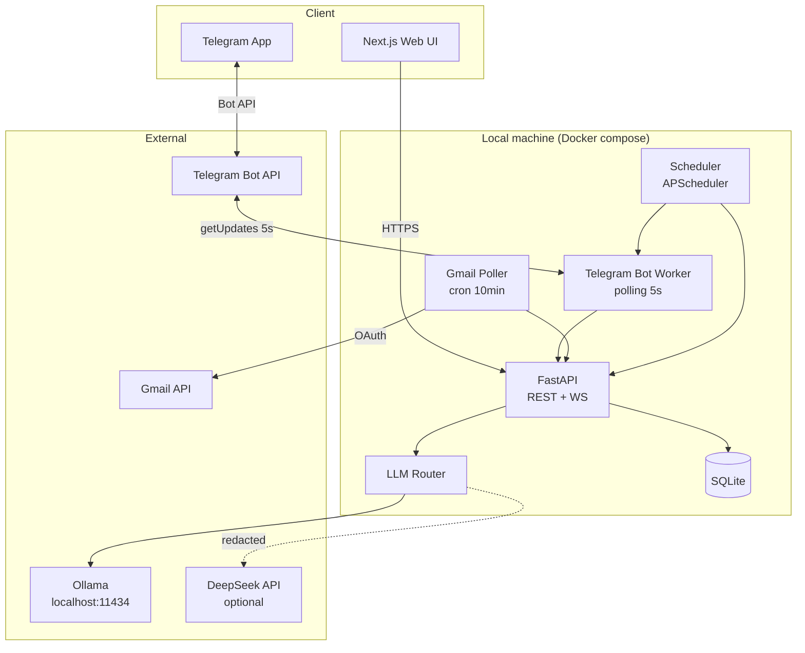
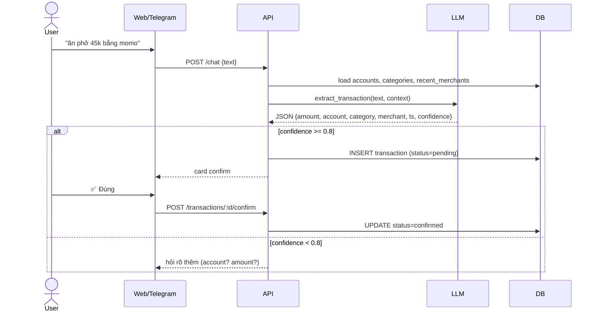
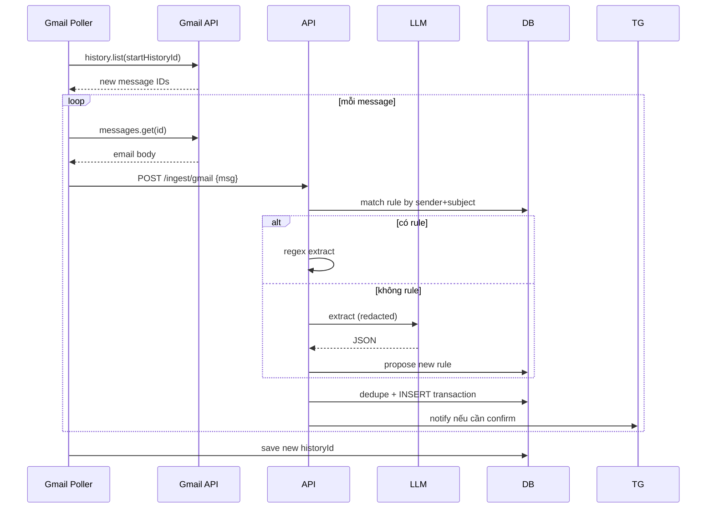
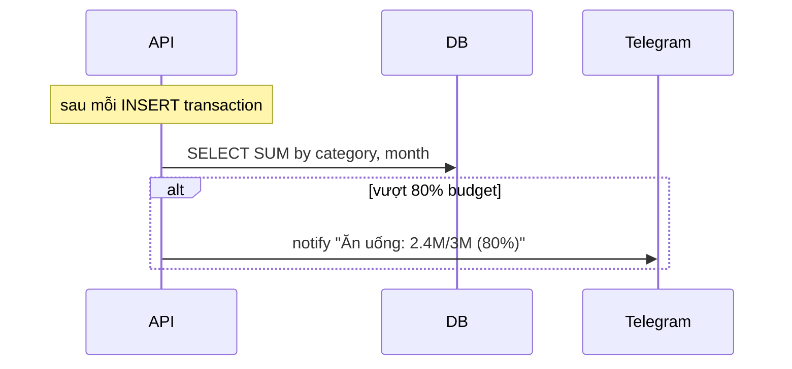

# 02 — Kiến trúc hệ thống

## Sơ đồ tổng thể

## Các thành phần

### 1. Web UI — Next.js
- Dashboard, danh sách giao dịch, form nhập tay, chat UI, cấu hình.
- Giao tiếp backend qua REST (CRUD) + WebSocket (streaming chat LLM, notify live).
- Chạy trên `:3000`.

### 2. API — FastAPI
- Lớp HTTP duy nhất. Mọi input đều đi qua đây.
- Chịu trách nhiệm validate, dedupe, lưu DB, gọi LLM.
- Expose REST + WS. Tham khảo [09-api.md](./09-api.md).
- Chạy trên `:8000`.

### 3. Telegram Bot Worker
- Process riêng, short polling `getUpdates` mỗi **5 giây**.
- Không cần domain/HTTPS. Xem chi tiết trong [08-telegram.md](./08-telegram.md).
- Không xử lý business logic — forward sang API qua HTTP nội bộ.

### 4. Gmail Poller
- Process riêng, chạy mỗi 10 phút (configurable).
- Dùng `historyId` để incremental sync, chỉ kéo email mới.
- Parse qua pipeline 2 tầng (regex → LLM). Xem [07-gmail.md](./07-gmail.md).

### 5. Scheduler
- APScheduler trong cùng process với API (hoặc tách nếu cần).
- Job định kỳ: tổng kết tuần/tháng, nhắc nhập liệu, backup DB.

### 6. LLM Router
- Module trong API, không phải service riêng.
- Quyết định dùng Ollama hay DeepSeek dựa trên task + độ nhạy cảm của input.
- Xem [06-llm-strategy.md](./06-llm-strategy.md).

### 7. Database — SQLite
- Single file `data/money.db`.
- Đủ cho 1 user, tránh overhead Postgres.
- Migrate qua Alembic.

## Luồng dữ liệu chính

### A. Nhập giao dịch qua chat (web hoặc Telegram)

### B. Nhập từ Gmail

### C. Cảnh báo budget

## Tách process & chạy song song

| Process | Vai trò | Scale |
|---|---|---|
| `api` | REST + WS + Scheduler | 1 instance |
| `web` | Next.js | 1 instance |
| `bot` | Telegram polling | 1 instance (tránh trùng offset) |
| `gmail` | Gmail polling | 1 instance |
| `ollama` | LLM local | 1 instance (nặng RAM) |

Không cần queue ở MVP vì throughput thấp (< 100 giao dịch/ngày). Khi cần thì thêm Redis + RQ.

## State & persistence

| State | Lưu ở đâu |
|---|---|
| Giao dịch, category, budget, rule | SQLite |
| Gmail `historyId`, Telegram `update_id` offset | bảng `sync_state` trong SQLite |
| LLM prompt/response log (debug) | file `logs/llm.jsonl` |
| OAuth refresh token | bảng `oauth_credentials` (mã hoá) |
| User preferences (UI) | bảng `settings` |

Backup: dump SQLite hàng đêm ra `backups/money-YYYYMMDD.db`, giữ 30 ngày.
