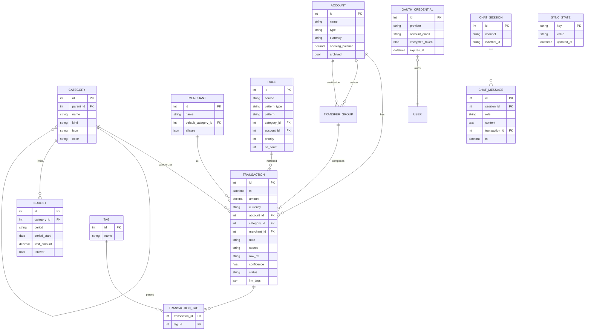

# 04 — Data model

## ERD



## Bảng chi tiết

### `account`
Tài khoản / ví tiền.

| Cột | Kiểu | Ghi chú |
|---|---|---|
| id | int PK | |
| name | text | "Momo", "VCB", "Tiền mặt"… |
| type | text | `cash` / `bank` / `ewallet` / `credit` |
| currency | text(3) | mặc định `VND` |
| opening_balance | numeric(18,2) | số dư đầu kỳ |
| archived | bool | ẩn khỏi UI nhưng giữ lịch sử |
| created_at | datetime | |

Số dư hiện tại = `opening_balance + SUM(transactions.amount)` (tính on-the-fly hoặc materialized view).

### `category`
Phân loại chi tiêu / thu nhập. Dạng cây (self-reference).

| Cột | Kiểu | Ghi chú |
|---|---|---|
| id | int PK | |
| parent_id | int FK nullable | null = category gốc |
| name | text | |
| kind | text | `expense` / `income` / `transfer` |
| icon | text | emoji hoặc tên icon |
| color | text | hex |

Ví dụ cây:
```
Ăn uống
├── Sáng
├── Trưa
└── Tối
Đi lại
├── Grab
└── Xăng xe
Lương (kind=income)
```

### `transaction`
Bảng trung tâm.

| Cột | Kiểu | Ghi chú |
|---|---|---|
| id | int PK | |
| ts | datetime | thời điểm giao dịch |
| amount | numeric(18,2) | **âm = chi, dương = thu** (đồng nhất dấu, đơn giản logic SUM) |
| currency | text(3) | |
| account_id | int FK | |
| category_id | int FK nullable | null = chưa phân loại |
| merchant_id | int FK nullable | |
| note | text | user-facing |
| source | text | `manual` / `chat_web` / `chat_telegram` / `gmail` / `sms` / `import_csv` |
| raw_ref | text | hash hoặc ID gốc (message_id của Gmail, update_id của Telegram) — dùng để dedupe |
| confidence | real | 0–1, do LLM gán; manual = 1.0 |
| status | text | `pending` (chờ confirm) / `confirmed` / `rejected` |
| llm_tags | json | metadata LLM: prompt_version, model, raw_json |
| created_at | datetime | |
| updated_at | datetime | |

**Index:**
- `(account_id, ts DESC)` — timeline theo tài khoản
- `(category_id, ts DESC)` — dashboard category
- `(status, ts)` — list pending
- UNIQUE `(source, raw_ref)` WHERE `raw_ref IS NOT NULL` — chống duplicate

**Transfer** giữa 2 account (rút tiền mặt từ bank, nạp tiền mặt vào bank, chuyển giữa ngân hàng…): lưu 2 row ngược dấu, cùng một `transfer_group_id` (cột extra), category `kind=transfer`. Không tính vào chi/thu. Xem bảng `transfer_group` dưới đây.

### `transfer_group`
Nhóm 2+ transaction thuộc 1 lần chuyển tiền.

| Cột | Kiểu | Ghi chú |
|---|---|---|
| id | int PK | |
| ts | datetime | thời điểm chuyển |
| from_account_id | int FK | account nguồn |
| to_account_id | int FK | account đích |
| amount | numeric(18,2) | **luôn dương** — giá trị chuyển |
| fee | numeric(18,2) | phí giao dịch, nếu có |
| currency | text(3) | |
| fx_rate | numeric(18,6) | tỷ giá nếu khác currency |
| note | text | |
| source | text | `manual` / `gmail` / `chat_*` |

Mỗi `transfer_group` tự động sinh ra 2 row `transaction`:
- Row 1: `account_id = from_account`, `amount = -(amount + fee)`, `transfer_group_id = X`.
- Row 2: `account_id = to_account`, `amount = +amount * (fx_rate or 1)`, `transfer_group_id = X`.

Cả 2 row có `category.kind = 'transfer'` → **bị loại khỏi tổng chi/thu** ở mọi query dashboard.

**Các use case phổ biến:**
| Tình huống | from | to | amount | fee |
|---|---|---|---|---|
| Rút ATM từ VCB về tiền mặt | VCB | Tiền mặt | 2.000.000 | 1.100 |
| Nạp tiền mặt vào Momo | Tiền mặt | Momo | 500.000 | 0 |
| Chuyển VCB → TCB | VCB | TCB | 5.000.000 | 0 |
| Đổi USD sang VND | USD cash | VND cash | 100 | 0 (fx_rate=25.000) |

### `budget`

| Cột | Kiểu | Ghi chú |
|---|---|---|
| id | int PK | |
| category_id | int FK nullable | null = budget tổng |
| period | text | `monthly` / `weekly` |
| period_start | date | đầu kỳ (1 hàng / kỳ, hoặc template lặp lại) |
| limit_amount | numeric(18,2) | |
| rollover | bool | true = cộng dồn phần chưa tiêu sang kỳ sau |

Cách dùng: có thể là template (period_start = 1 hàng duy nhất, apply mọi kỳ) hoặc override per-kỳ. MVP: template đủ.

### `allocation_bucket` + `bucket_category`

Tầng phân bổ cao hơn Budget — nhóm category thành "mục đích" (Thiết yếu, Mong muốn, Tiết kiệm…) để lập `monthly_plan`.

`allocation_bucket`:

| Cột | Kiểu | Ghi chú |
|---|---|---|
| id | int PK | |
| name | text unique | "Thiết yếu", "Mong muốn", … |
| icon, color | text | UI |
| sort_order | int | ordering |
| archived | bool | soft delete |
| note | text | |

`bucket_category` (M2M, nhưng enforce 1 category → 1 bucket ở application layer):

| Cột | Kiểu | Ghi chú |
|---|---|---|
| bucket_id | int FK PK | CASCADE |
| category_id | int FK PK | CASCADE, chỉ `kind=expense` |

### `monthly_plan` + `plan_allocation`

`monthly_plan` (1 hàng/tháng):

| Cột | Kiểu | Ghi chú |
|---|---|---|
| id | int PK | |
| month | date unique | luôn là ngày 1 của tháng |
| expected_income | numeric(18,2) | thu nhập dự kiến (input hoặc auto-suggest) |
| strategy | text | `soft` / `envelope` / `zero_based` / `pay_yourself_first` |
| carry_over_enabled | bool | dư/vượt bucket có cộng sang tháng sau không |
| note | text | |

`plan_allocation` (nhiều hàng / 1 plan):

| Cột | Kiểu | Ghi chú |
|---|---|---|
| id | int PK | |
| monthly_plan_id | int FK | CASCADE |
| bucket_id | int FK | RESTRICT (không xoá bucket nếu đang có allocation) |
| method | text | `amount` hoặc `percent` |
| value | numeric(18,2) | VND nếu amount, % nếu percent |
| rollover | bool | bucket này có rollover sang tháng sau không |
| note | text | |

Unique `(monthly_plan_id, bucket_id)` — 1 bucket chỉ có 1 allocation trong 1 plan.

**Allocated computed** (ở service, không persist): `amount` → dùng `value` trực tiếp. `percent` → `expected_income * value / 100`.

**Carry-in** (1-month look-back): nếu plan.carry_over_enabled và alloc.rollover → `carry_in = prev_allocated − prev_spent` (signed). Chỉ nhìn 1 tháng trước, không chain xa hơn.

### `rule`
Quy tắc tự động phân loại / gán account.

| Cột | Kiểu | Ghi chú |
|---|---|---|
| id | int PK | |
| source | text | `gmail` / `chat` / `merchant_name` |
| pattern_type | text | `regex` / `contains` / `sender_match` |
| pattern | text | e.g. `from:*@vcb.com.vn && subject:Giao dich` |
| extractor | json | template regex cho amount/merchant/ts |
| category_id | int FK nullable | |
| account_id | int FK nullable | |
| priority | int | cao hơn match trước |
| hit_count | int | đếm lần match, để sort/dọn rule không dùng |
| created_by | text | `user` / `llm_suggest` |
| enabled | bool | |

### `merchant`
Chuẩn hoá tên cửa hàng (vì email ngân hàng hay ghi lộn xộn).

| Cột | Kiểu |
|---|---|
| id | int PK |
| name | text (canonical) |
| default_category_id | int FK |
| aliases | json | list các biến thể: "GRAB*HCM", "Grab Vietnam Co"… |

Khi parse giao dịch, match alias (lowercase, strip dấu) để tìm merchant.

### `tag` + `transaction_tag`
Many-to-many cho label tự do (`#công-tác`, `#quà-tặng`).

### `oauth_credential`
Lưu refresh_token Google, mã hoá bằng key đọc từ env.

| Cột | Kiểu |
|---|---|
| provider | text | `google` |
| account_email | text | |
| encrypted_token | blob | AES-GCM với key từ `APP_ENCRYPTION_KEY` |
| scopes | text | space-separated |
| expires_at | datetime | của access token |

### `sync_state`
Key-value cho con trỏ đồng bộ.

| key | value ví dụ |
|---|---|
| `gmail.history_id` | `12345678` |
| `gmail.last_poll_at` | ISO datetime |
| `telegram.update_offset` | `9876` |

### `chat_session` + `chat_message`
Lưu hội thoại để LLM có context.

| chat_session | |
|---|---|
| channel | `web` / `telegram` |
| external_id | Telegram chat_id hoặc UUID session web |

| chat_message | |
|---|---|
| role | `user` / `assistant` / `system` |
| content | text |
| transaction_id | nullable FK nếu dẫn tới giao dịch |

Giữ lại 30 ngày, auto-prune.

### `llm_gmail_policy`
Allowlist / denylist kiểm soát LLM tools được đọc email nào. Xem [14-llm-tools.md](./14-llm-tools.md#policy-engine).

| Cột | Kiểu | Ghi chú |
|---|---|---|
| id | int PK | |
| action | text | `allow` / `deny` (deny thắng allow) |
| pattern_type | text | `from` / `to` / `label` / `subject` / `query` |
| pattern | text | glob cho sender (`*@vcb.com.vn`) hoặc text match |
| priority | int | cao = xét trước |
| enabled | bool | |
| created_at | datetime | |
| note | text | user ghi chú lý do |

Khi tool `gmail.search` được gọi, engine build lại query:
```
rewritten = f"({allow_clauses}) {deny_clauses} AND ({user_query})"
```
Nếu không có `allow` nào enabled → từ chối mọi call.

### `llm_tool_call_log`
Audit log mọi tool call của agent. Ghi cả khi Langfuse offline.

| Cột | Kiểu | Ghi chú |
|---|---|---|
| id | int PK | |
| ts | datetime | |
| session_id | text FK `chat_session.id` | |
| turn_index | int | |
| tool_name | text | `gmail.search`, `gmail.read_message`, `db.query_transactions`, ... |
| params_json | json | sau khi policy rewrite |
| input_hash | text | sha256 của raw params (không lưu raw content) |
| result_summary | text | e.g. "5 messages" — không lưu body |
| status | text | `ok` / `denied` / `error` / `rate_limited` |
| duration_ms | int | |
| error | text | nullable |
| trace_id | text | link tới Langfuse trace nếu có |

Retention: 90 ngày, prune bởi scheduler. Index: `(session_id, ts DESC)`, `(tool_name, ts)`.

### `llm_tool_search_cache`
Cache kết quả `gmail.search` cho enforcement `gmail.read_message` (msg_id phải thuộc kết quả search gần đây trong session).

| Cột | Kiểu |
|---|---|
| session_id | text |
| message_id | text |
| seen_at | datetime |
| expires_at | datetime (seen_at + 10 phút) |

PK `(session_id, message_id)`. Prune khi expires.

### `settings`
Single-row key-value cho UI preferences (default account, theme, locale, LLM cloud toggle, agent enable, Gmail tool enable).

## Migration strategy

- Alembic, 1 migration / PR.
- Không đổi kiểu cột non-null trực tiếp — tạo cột mới → backfill → drop cột cũ.
- Down migration luôn phải chạy được (khi dev/test).

## Dedup logic

Khi ingest giao dịch mới, match thứ tự:

1. Exact match `(source, raw_ref)` → skip.
2. Fuzzy match: `account_id` + `ABS(amount) = X` + `ts` cách ±5 phút + `merchant` similarity > 0.8 → đánh dấu duplicate candidate, hỏi user confirm.
3. Không trùng → insert mới.

## Query ví dụ

### Chi tiêu tháng theo category (loại transfer)
```sql
SELECT c.name, SUM(t.amount) AS total
FROM transaction t
JOIN category c ON c.id = t.category_id
WHERE t.ts >= :month_start AND t.ts < :month_end
  AND t.status = 'confirmed'
  AND c.kind = 'expense'                   -- loại income & transfer
GROUP BY c.id
ORDER BY total ASC;
```

### Số dư theo account (real-time)
```sql
SELECT a.id, a.name, a.type,
       a.opening_balance + COALESCE(SUM(t.amount), 0) AS balance
FROM account a
LEFT JOIN transaction t
  ON t.account_id = a.id AND t.status = 'confirmed'
WHERE a.archived = 0
GROUP BY a.id;
```

### Luồng chuyển giữa account (flow analysis)
```sql
SELECT tg.from_account_id, tg.to_account_id,
       COUNT(*) AS n, SUM(tg.amount) AS total
FROM transfer_group tg
WHERE tg.ts >= :month_start
GROUP BY tg.from_account_id, tg.to_account_id;
```

### % budget đã dùng
```sql
WITH spent AS (
  SELECT category_id, SUM(ABS(amount)) AS s
  FROM transaction
  WHERE ts >= :month_start AND status = 'confirmed'
  GROUP BY category_id
)
SELECT b.category_id, b.limit_amount,
       COALESCE(s.s, 0) AS spent,
       COALESCE(s.s, 0) * 1.0 / b.limit_amount AS pct
FROM budget b LEFT JOIN spent s ON s.category_id = b.category_id
WHERE b.period = 'monthly';
```
