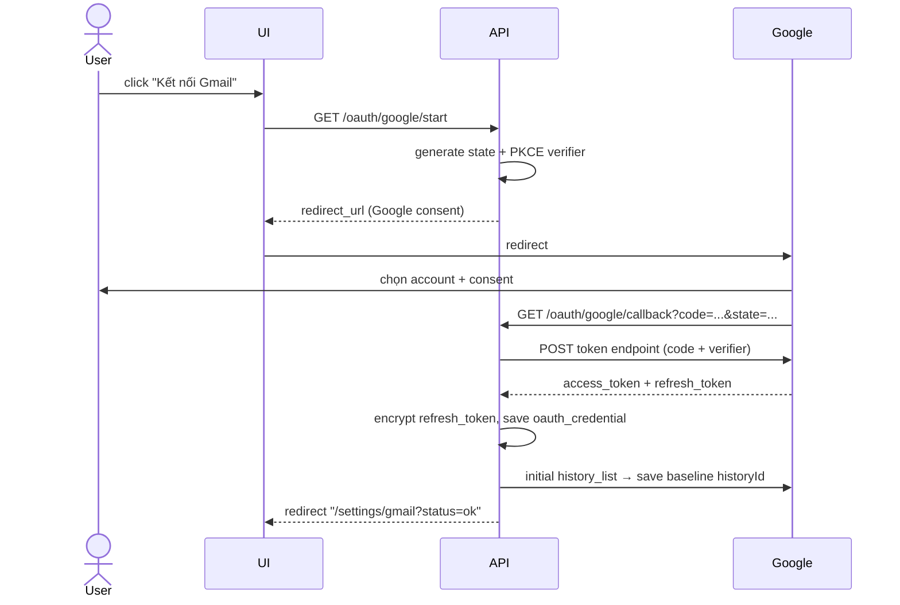
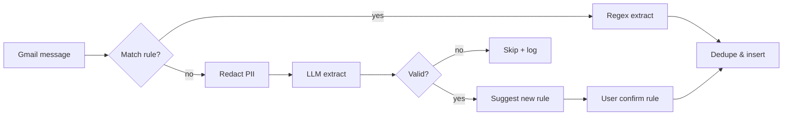

# 07 — Tích hợp Gmail

## Mục tiêu

Tự động ingest email thông báo giao dịch từ ngân hàng / ví điện tử, biến thành `transaction` trong DB mà user không phải làm gì.

## Scope OAuth

- Scope: `https://www.googleapis.com/auth/gmail.readonly`.
- App type: **Desktop application** (hoặc Web với redirect `http://localhost:8000/oauth/google/callback`).
- Chỉ 1 user (owner) → dùng OAuth consent screen **Testing** với `test user = <email của bạn>`, không cần verify.
- **Scope này được chia sẻ cho cả 2 flow**: (a) Gmail poller ingest định kỳ, (b) LLM agent tool readonly. Xem [14-llm-tools.md](./14-llm-tools.md) cho policy engine kiểm soát LLM được đọc email nào.

## Flow đăng ký OAuth



Refresh token KHÔNG hết hạn (cho testing scope đủ 1 user). Access token 1h → code tự refresh khi 401.

## Polling strategy

### Vì sao polling thay vì push notification
- Push (Pub/Sub) cần GCP project có billing + domain verification → over-engineering.
- Polling mỗi 10 phút đủ cho use case cá nhân (không cần realtime < 1 phút).
- Tiết kiệm: 1 call `history.list` mỗi 10 phút = 144 call/ngày, miễn phí tier.

### Cấu hình
- `GMAIL_POLL_INTERVAL_SEC = 600` (10 phút).
- `GMAIL_FILTER_LABELS = ["INBOX"]`.
- `GMAIL_FILTER_SENDERS = ["*@vcbonline.com.vn","no-reply@momo.vn",...]` (configurable).

### Algorithm

```python
async def poll_gmail():
    creds = load_credentials()
    service = build_gmail_service(creds)

    start_id = sync_state.get("gmail.history_id")
    if start_id is None:
        # lần đầu: lấy 30 ngày gần nhất, set baseline
        start_id = bootstrap_baseline(service)
        return

    try:
        changes = service.users().history().list(
            userId="me",
            startHistoryId=start_id,
            historyTypes=["messageAdded"]
        ).execute()
    except HttpError as e:
        if e.resp.status == 404:  # historyId too old
            changes = bootstrap_baseline(service)
        else:
            raise

    new_msg_ids = extract_message_ids(changes)
    for mid in new_msg_ids:
        msg = service.users().messages().get(userId="me", id=mid, format="full").execute()
        if match_filter(msg):
            await ingest_email(msg)

    sync_state.set("gmail.history_id", changes["historyId"])
```

### Xử lý khi historyId hết hạn (7 ngày)
- Google expire history nếu offline quá lâu.
- Fallback: `messages.list(q="newer_than:2d from:(...)")` để bootstrap lại, dedupe theo `message_id`.

## Pipeline parse 2 tầng



### Tầng 1 — Rule (regex)

Mỗi ngân hàng có 1 rule set. Ví dụ cho **VCB**:

```yaml
name: "VCB giao dịch"
source: gmail
pattern_type: sender_match
pattern:
  from: "*@vcbonline.com.vn"
  subject_contains: "Giao dich"
extractor:
  amount: 'Số tiền:\s*(?:VND|USD)?\s*([\d,.]+)'
  account_last4: 'tài khoản\s*\*+(\d{4})'
  merchant: 'Nội dung:\s*(.+?)(?:\n|$)'
  ts: 'Thời gian:\s*(\d{2}/\d{2}/\d{4}\s*\d{2}:\d{2})'
account_id: 2  # VCB đã tạo trong account table
category_id: null  # để LLM classify sau
```

Test rule: có `Rule playground` UI → paste email → xem match regex ra gì.

### Tầng 2 — LLM

Dùng khi rule miss hoặc regex extract thiếu field. Prompt xem [06-llm-strategy.md](./06-llm-strategy.md#62-extract-từ-email-extract_emailv1).

**Redaction pipeline** (luôn chạy trước khi gửi LLM, cả local lẫn cloud):

```python
def redact(text: str) -> str:
    text = re.sub(r'\b(\d{4}[\s-]?){3,4}\d{1,4}\b', r'****\g<0>[-4:]', text)  # card
    text = re.sub(r'\b\d{9,15}\b', lambda m: '****' + m.group()[-4:], text)   # STK
    text = re.sub(r'\b\d{6,8}\b(?=.*OTP)', '******', text)                    # OTP
    text = re.sub(r'Số dư[:\s].*', 'Số dư: [REDACTED]', text)                  # balance
    return text
```

### Học rule mới

Khi LLM extract thành công 1 email mà không rule nào match:

1. API sinh đề xuất rule dựa trên sender + common keywords trong subject.
2. Tạo record `rule` với `enabled=false`, `created_by='llm_suggest'`.
3. Notify Telegram:
   ```
   🆕 Đã nhận giao dịch mới từ "no-reply@tpb.vn"
   Số tiền: 250.000 VND | Merchant: "GRAB HCM"
   → Đã tạo rule đề xuất. [Duyệt] [Sửa] [Bỏ qua]
   ```
4. User duyệt → `enabled=true`, lần sau match tự động không cần LLM.

## Dedup

Email có thể gửi lặp (forward, retry SMTP). Key dedup:

1. `raw_ref = gmail.message_id` → UNIQUE index.
2. Nếu cùng `(account, amount, ts±2min)` xuất hiện với nguồn khác (chat user vừa nhập) → hỏi: "Có phải cùng 1 giao dịch không?" → merge hoặc giữ 2.

## Các ngân hàng / ví ưu tiên (MVP)

| Tên | Sender mẫu | Chất lượng email | Độ ưu tiên |
|---|---|---|---|
| Vietcombank | `*@vcbonline.com.vn` | Cấu trúc rõ, regex dễ | 1 |
| Techcombank | `*@techcombank.com.vn` | HTML nhiều, cần parse soup | 1 |
| MB Bank | `*@mbbank.com.vn` | OK | 2 |
| TPBank | `*@tpb.vn` | OK | 2 |
| Momo | `*@momo.vn` | Cấu trúc đẹp | 1 |
| ShopeePay | `*@shopee.vn` | Thường là hoá đơn tổng | 3 |
| ZaloPay | `*@zalopay.vn` | — | 3 |
| Grab (hoá đơn) | `*@grab.com` | Hoá đơn chuyến, không phải GD | 3 |

MVP: đảm bảo 2 trong danh sách priority-1 hoạt động tốt (user tự chọn).

## Xử lý edge case

### Email sao kê hàng tháng
- Chứa nhiều dòng giao dịch lịch sử → dễ duplicate với email thông báo từng giao dịch.
- Strategy: **bỏ qua** loại email này trong MVP (rule đánh dấu `is_statement=true` → skip).
- Phase 2: có thể dùng như nguồn backfill lịch sử cũ, với UI import có bước dedup thủ công.

### Email OTP lẫn vào
- Filter sớm bằng subject regex `(?i)(otp|mã xác thực|verify)`.

### Giao dịch bị huỷ / hoàn tiền
- Một số email có "Giao dịch huỷ" / "Refund" → tạo transaction ngược dấu, merchant giữ nguyên, note "refund of tx#X".

### Multi-currency
- Email USD (thẻ tín dụng quốc tế) → lưu `currency=USD`, `amount` theo USD. Convert sang VND ở view chứ không ở ingest.

## Testing

- Fixture: `tests/fixtures/emails/*.eml` — email thật đã redact.
- Test regex rule: mỗi rule có ≥ 3 mẫu pass + 2 mẫu không liên quan (phải không match).
- Test end-to-end: mock Gmail API, feed fixture → assert transaction được insert đúng.

## Quota & giới hạn

- Gmail API: 1 tỷ quota units/ngày (quá đủ).
- Rate limit: 250 units/user/second → không chạm.
- 1 `messages.get` = 5 units, 1 `history.list` = 2 units.

## Monitoring

- Metric: `gmail_poll_success_total`, `gmail_poll_errors_total`, `gmail_messages_ingested_total`, `gmail_llm_fallback_total`, `gmail_tool_calls_total` (từ LLM agent).
- Log mọi email không parse được vào `logs/gmail-unparsed.jsonl` để review sau.
- LLM tool calls được log riêng vào bảng `llm_tool_call_log` và Langfuse trace. Xem [14-llm-tools.md](./14-llm-tools.md#audit-log-local-complementary).

## LLM agent truy cập Gmail (readonly)

Ngoài poller tự động ingest, có 1 flow khác: **LLM agent** có thể gọi tool `gmail.search` / `gmail.read_message` để trả lời câu hỏi user trong chat. Access được kiểm soát bởi:

- **Policy engine** (bảng `llm_gmail_policy`): allowlist/denylist pattern sender/label/subject.
- **Deny-by-default**: chưa cấu hình → LLM đọc = 0 email.
- **Redaction**: body email redact số thẻ/STK/OTP trước khi trả về LLM.
- **Audit log**: mọi call ghi vào `llm_tool_call_log` + Langfuse trace.
- **Rate limit**: 20 Gmail API call / giờ từ agent.

Chi tiết: [14-llm-tools.md](./14-llm-tools.md).
